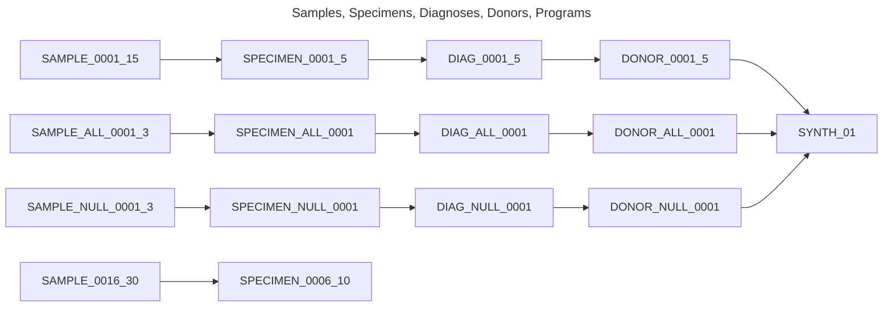
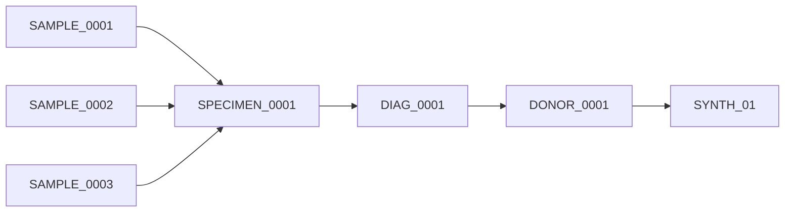
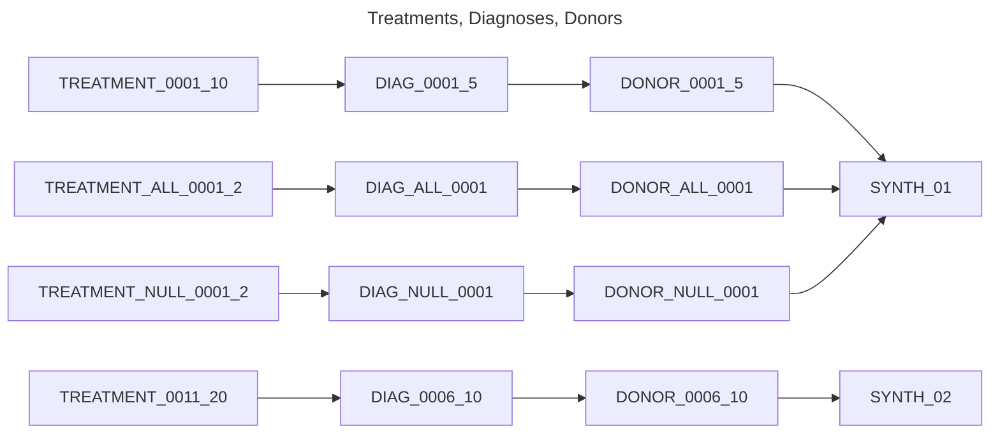
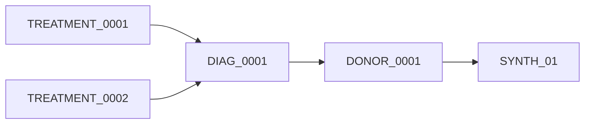
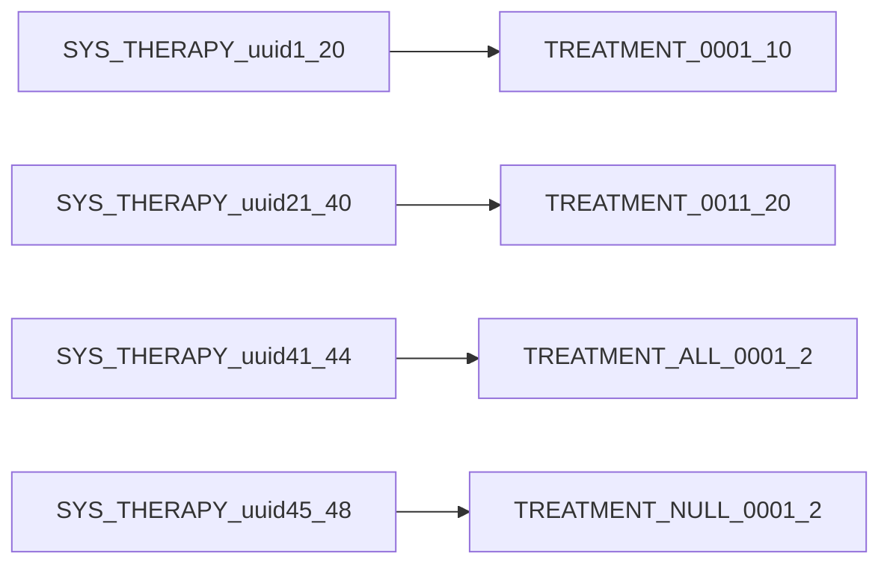
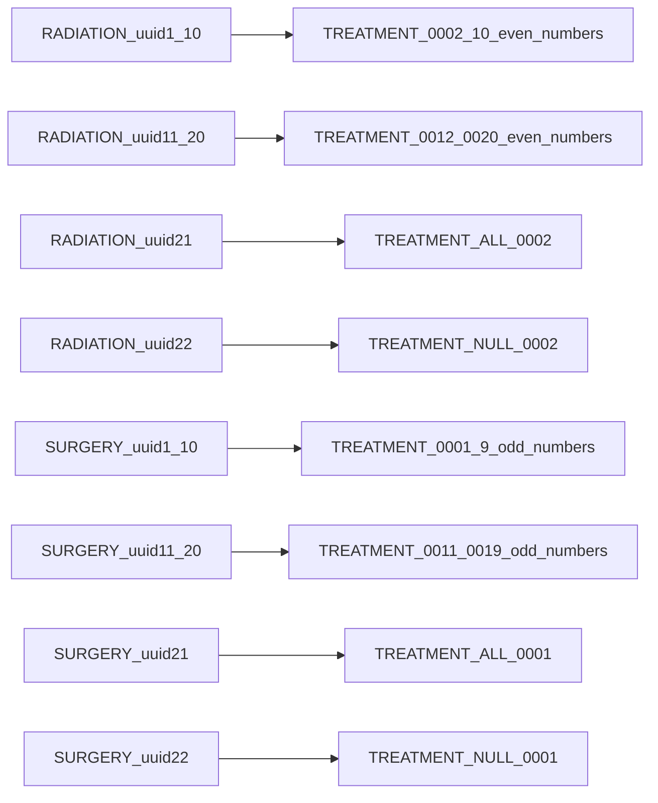
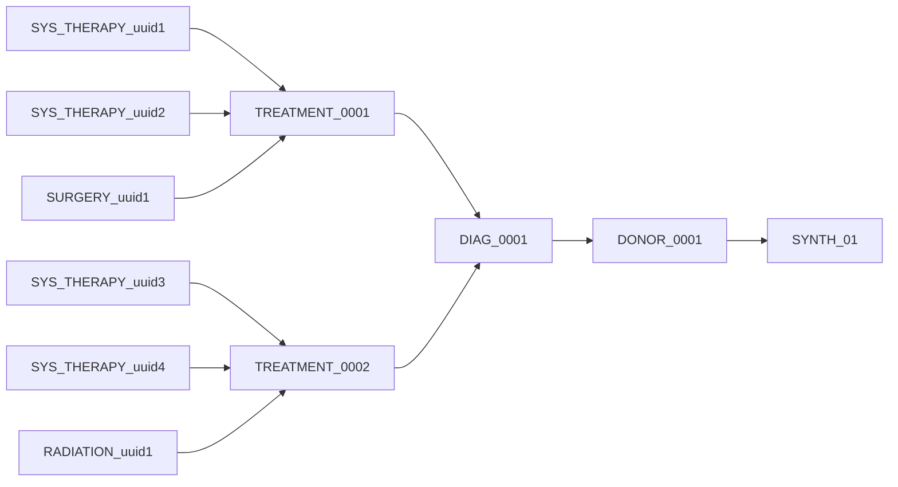
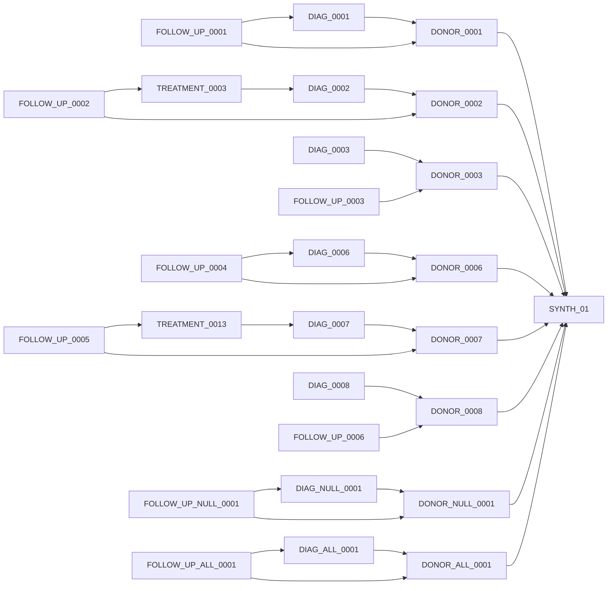
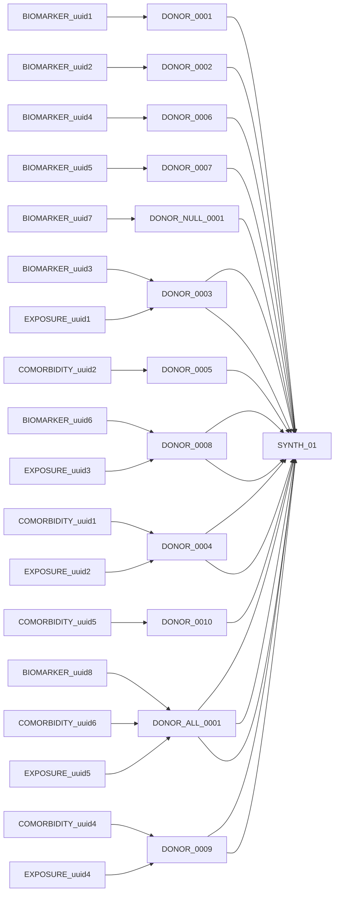

# Extra-small dataset relationships

The small dataset is composed of:
* 2 Programs
* 12 Donors, Primary Diagnoses, Specimens, Radiations, Surgeries
* 8 Follow Ups
* 6 Comorbidities, Biomarkers, Exposures
* 24 Treatments
* 36 Sample registrations
* 72 Systemic Therapies

Identifiers are numbered sequentially per object.

Diagrams below show example linkage relationships for the different objects.

---

## Sample Registrations, Specimens and Primary Diagnoses to Donors

Each donor has one primary diagnosis, each primary diagnosis has one specimen, each specimen has three samples.

Each Specimen has three linked samples, example below with SPECIMEN_0001

---

## Treatments and treatment types

Each diagnosis has two treatments, 

Each Diagnosis has two linked treatments, example below with DIAG_0001

Each treatment has two systemic therapies and either a radiation or surgery.

Radiations are linked to the even numbered treatments while Surgeries are linked to odd numbered treatments. Example with `TREATMENT_0001` below:

---

## Follow ups

Follow ups are linked to the first 3 donors of each program. 

---

## Biomarkers, Comorbidities, Exposures to Donors

Synthetic data is only links Biomarkers to Donors Only. 

The first 3 donors have a linked biomarker objects

The second 3 donors have a linked comorbidity object

Exposures are linked to the 'middle' 3 donors, sometimes linked with comorbidities, sometimes with biomarkers

---