# Small dataset relationships

The small dataset is composed of:
* 4 programs
* 20 Follow Ups
* 30 Exposures
* 40 Comorbidities, Biomarkers
* 80 Donors, Primary Diagnoses, Specimens, Radiations, Surgeries
* 160 Treatments
* 240 Sample registrations
* 320 Systemic Therapies

Sub-objects are iterated over and assigned evenly to a parent object until all objects are exhausted. Identifiers show the pattern in the diagrams below.

e.g.

This is a diagram of the synthetic relationships between the models in the dataset.

20 donors per program.

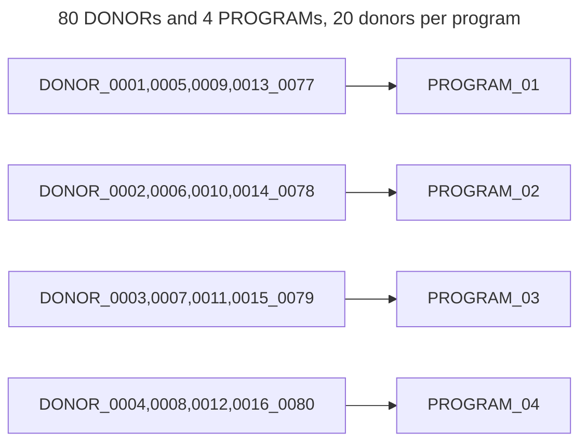

---

1 Primary Diagnosis per donor.

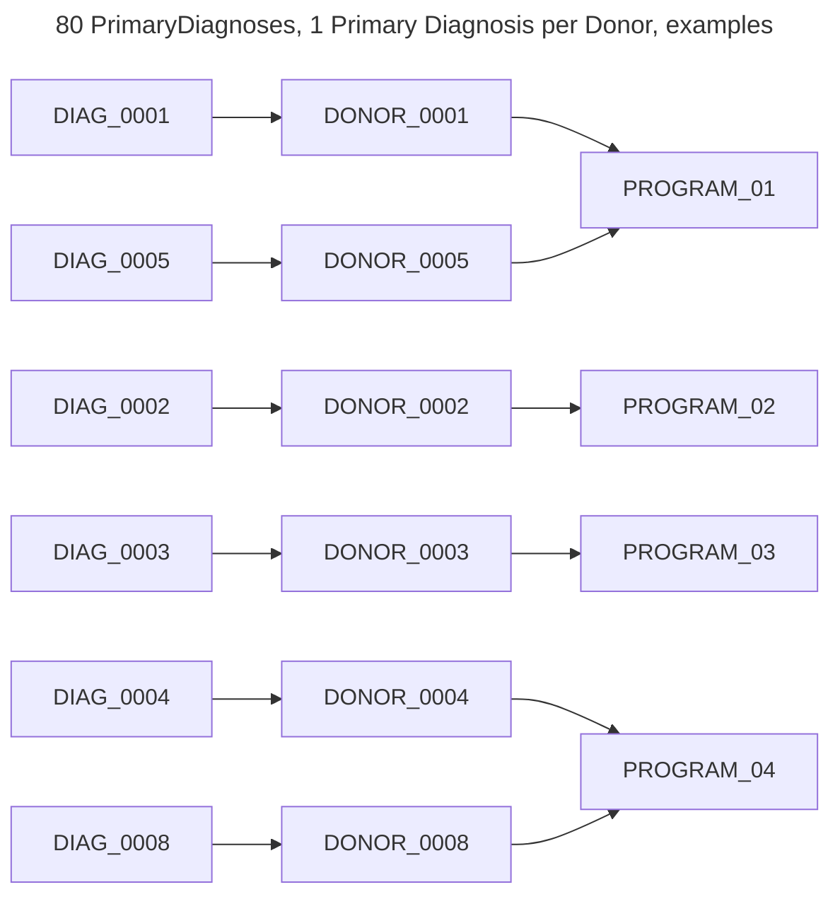

---

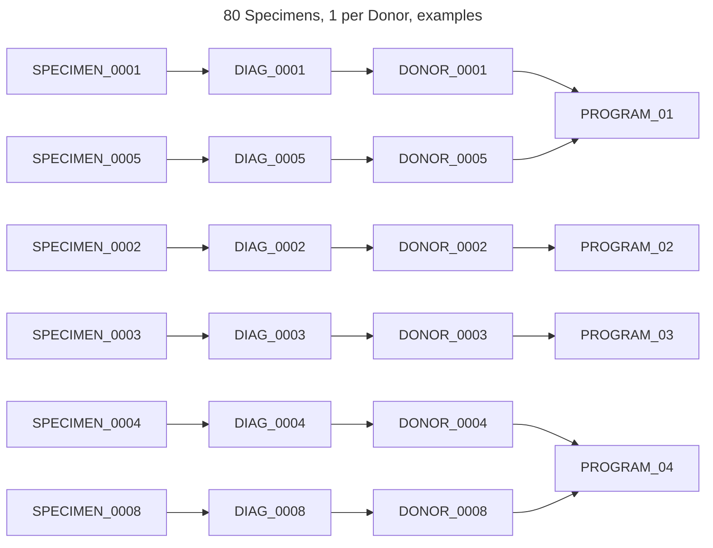

---

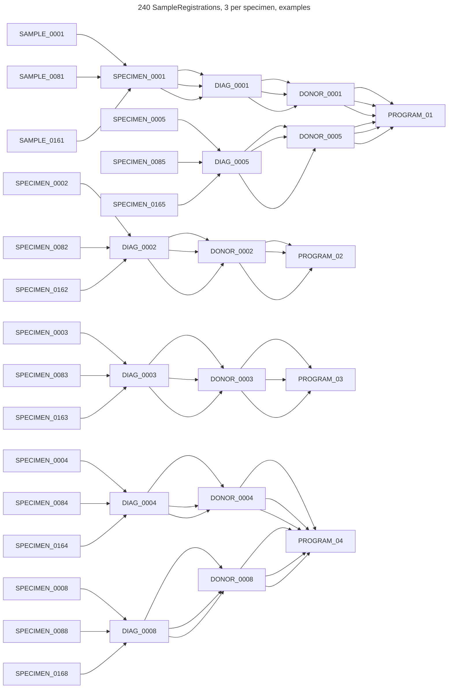

---

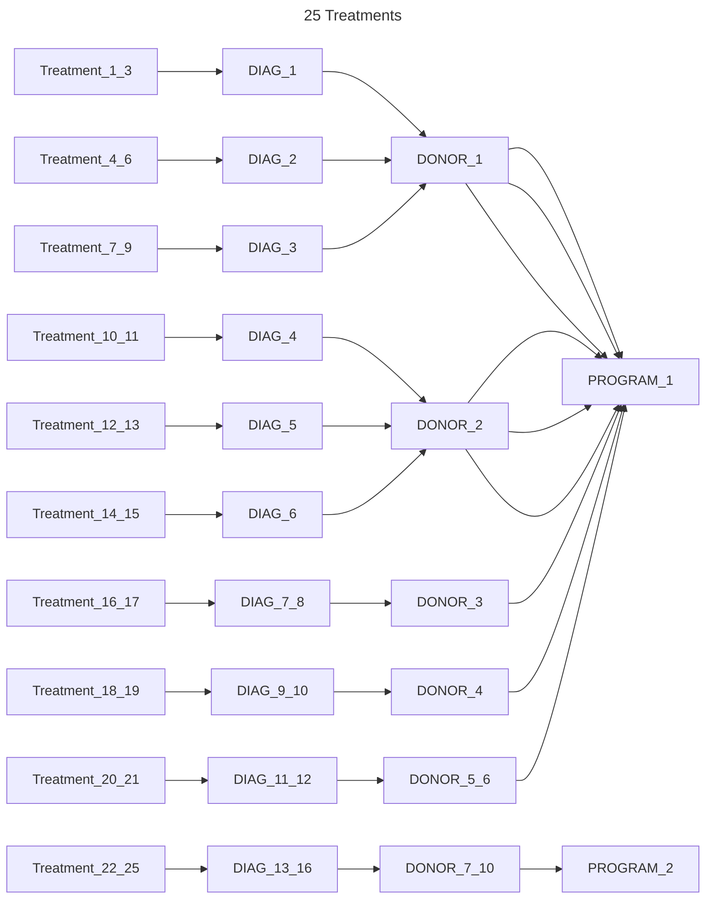

---

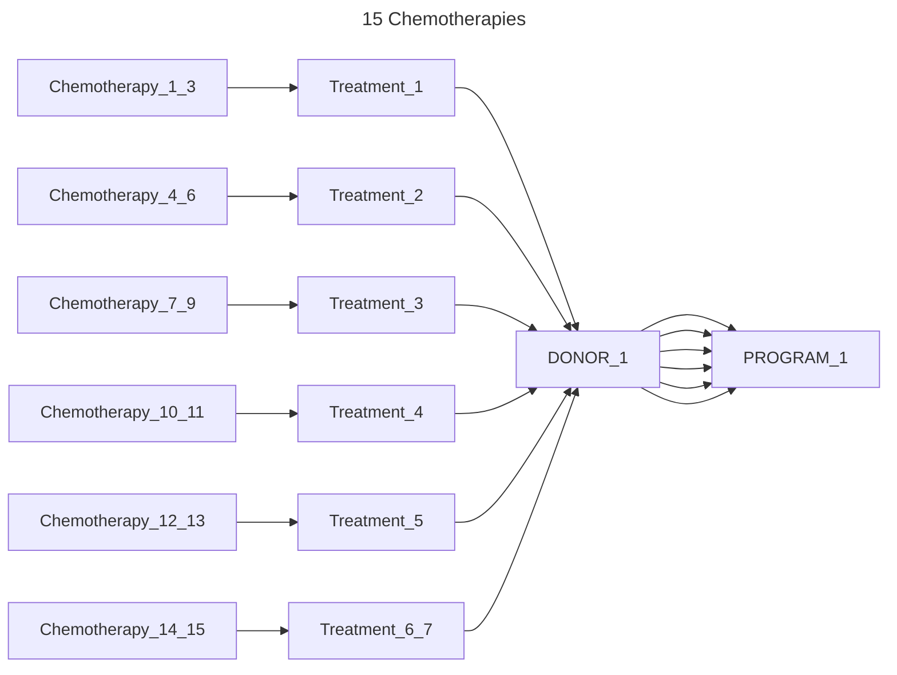

---

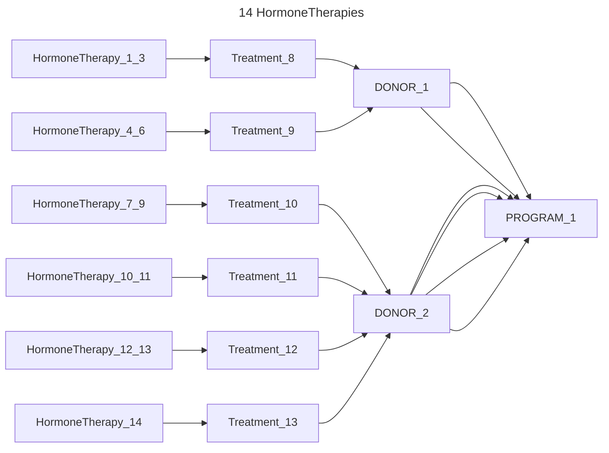

---

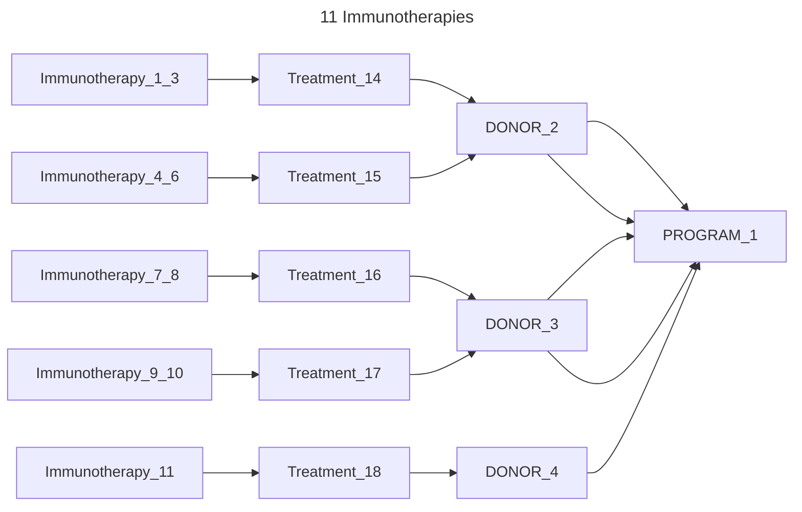

---

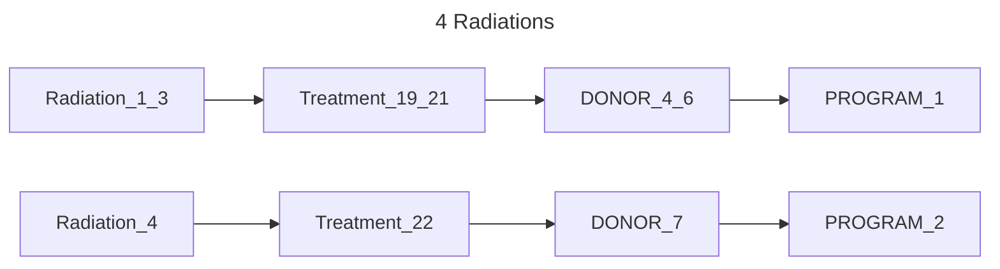

---

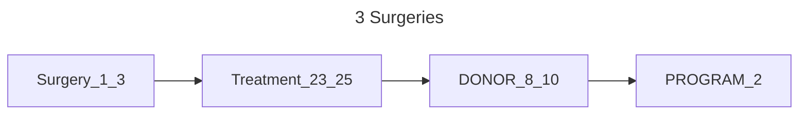

---

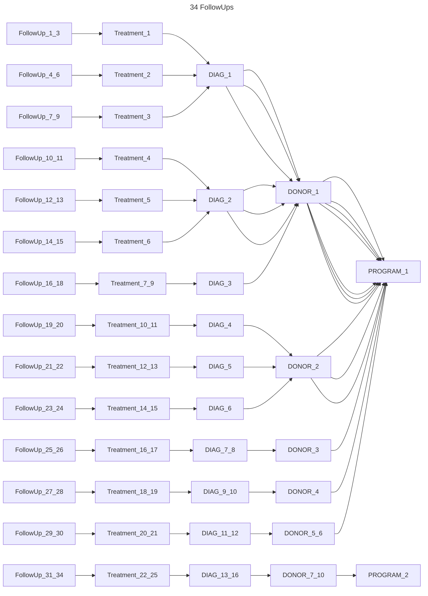

---

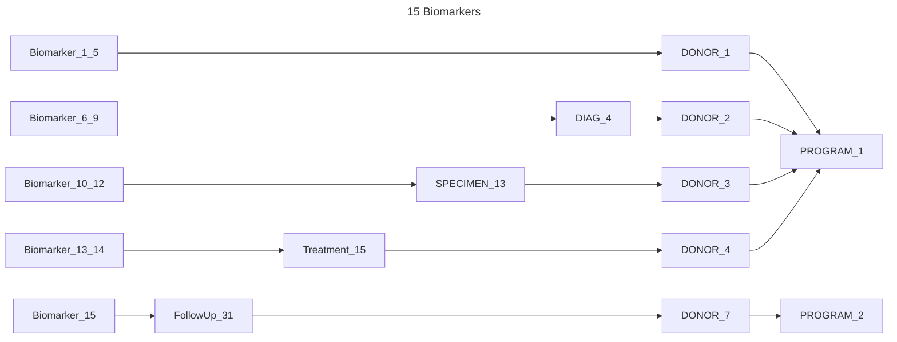

---

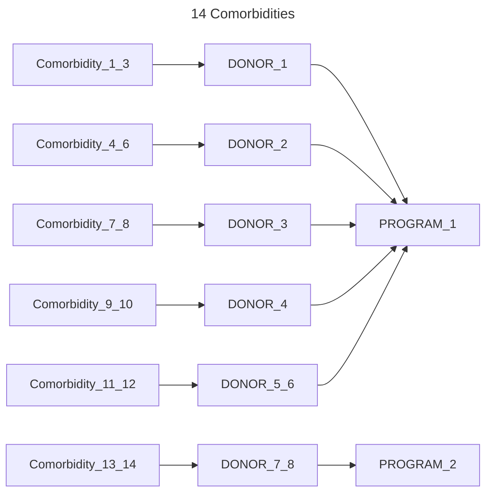

---

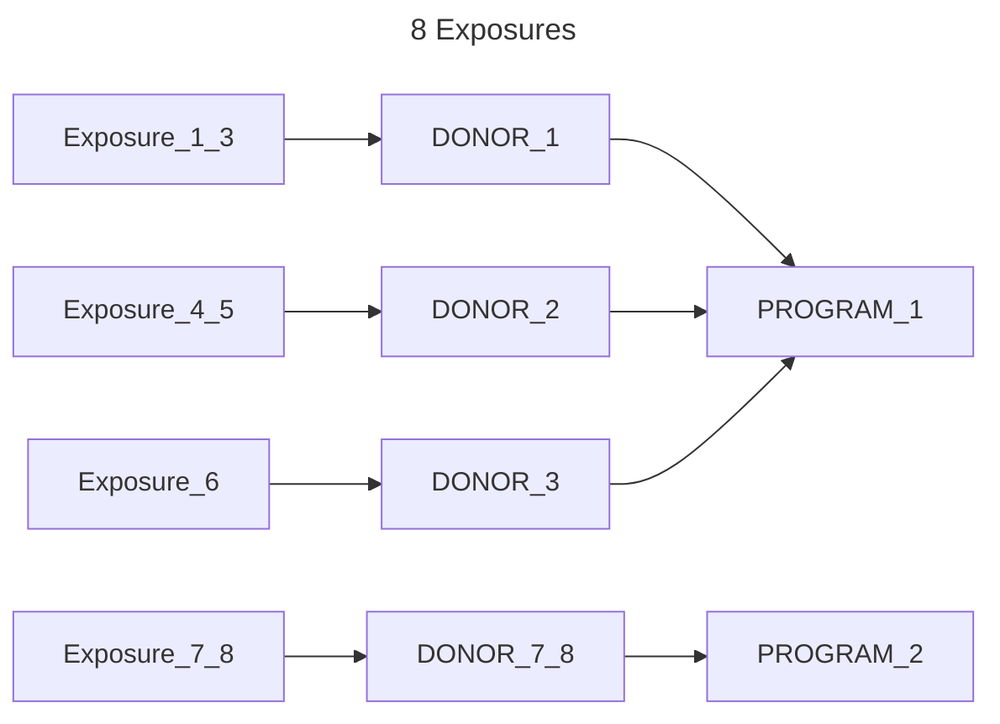
