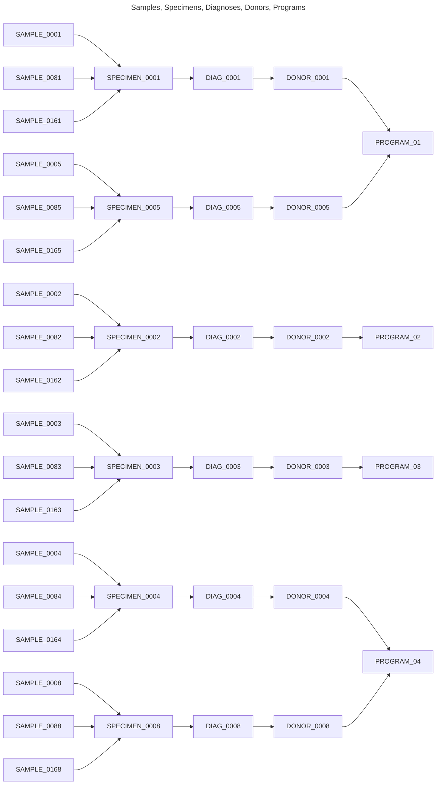
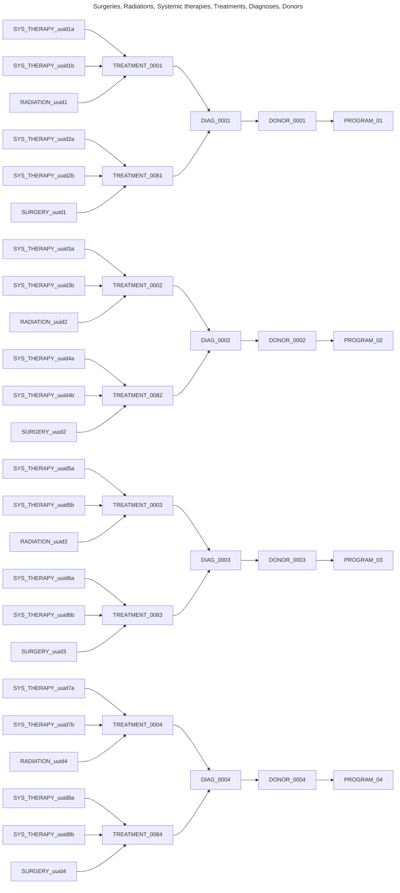
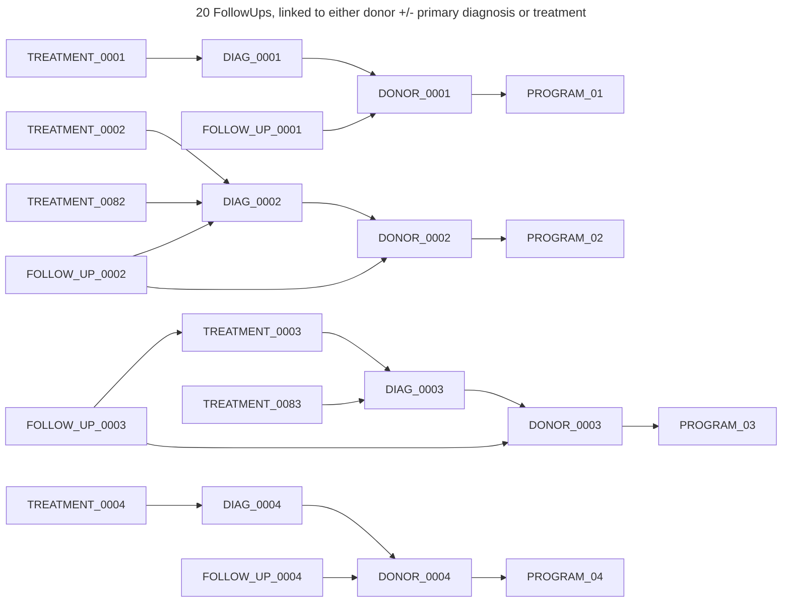
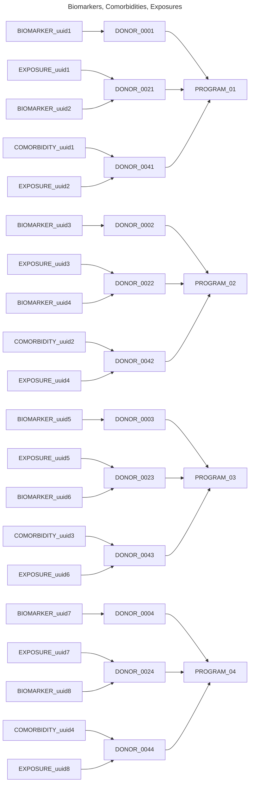

# Small dataset relationships

The small dataset is composed of:
* 4 Programs
* 20 Follow Ups
* 40 Comorbidities, Biomarkers, Exposures
* 80 Donors, Primary Diagnoses, Specimens, Radiations, Surgeries
* 160 Treatments
* 240 Sample registrations
* 320 Systemic Therapies

Sub-objects are iterated over and assigned evenly to a parent object until all objects are exhausted. Identifiers show the pattern in the diagrams below.

Diagrams below show example linkage relationships for the different objects.

---

## Sample Registrations, Specimens and Primary Diagnoses to Donors

Each donor has one primary diagnosis, each primary diagnosis has one specimen, each specimen has three samples.

---

## Treatments and treatment types

Each diagnosis has two treatments, each treatment has two systemic therapies and either a radiation or surgery.

---

## Follow ups

Follow ups is linked to Donor only or to Donor plus either a Primary Diagnosis or Treatment.

---

## Biomarkers, Comorbidities, Exposures to Donors

Biomarkers may be linked to Donor alone or Donor plus treatment, primary diagnosis, specimen or followup. Synthetic data is only linked to Donors for now. Half of donors have a linked biomarker object. Comorbidities are linked directly to Donors, half of the donors in the dataset have a linked comorbidity. Exposures are linked directly to Donors, half of donors have a linked exposure.

---
