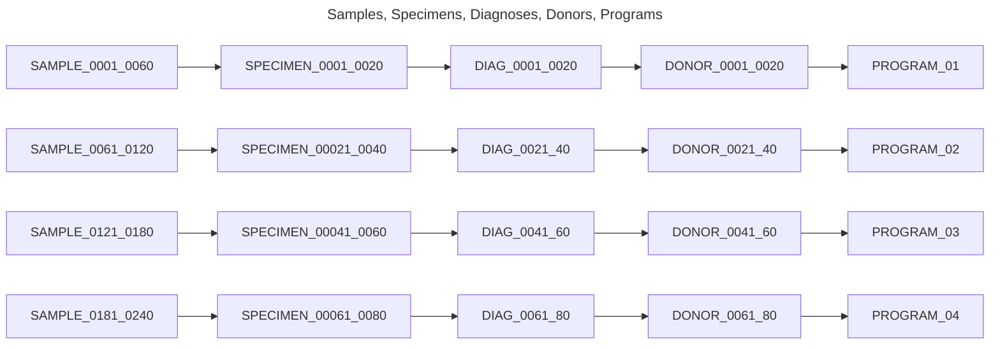
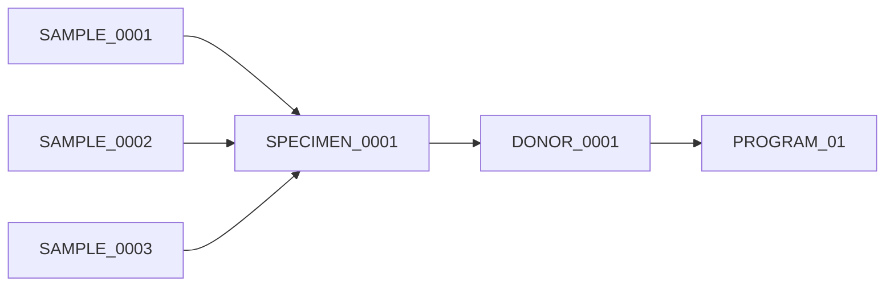
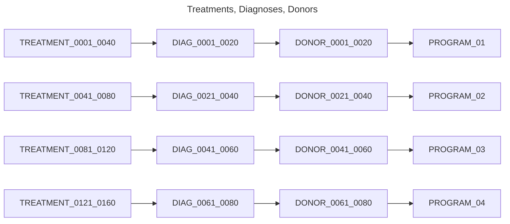
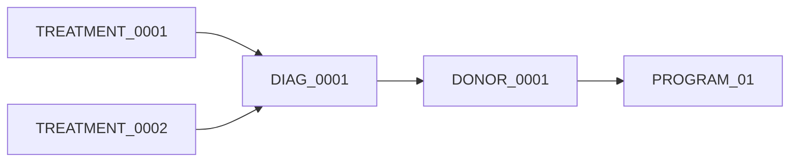
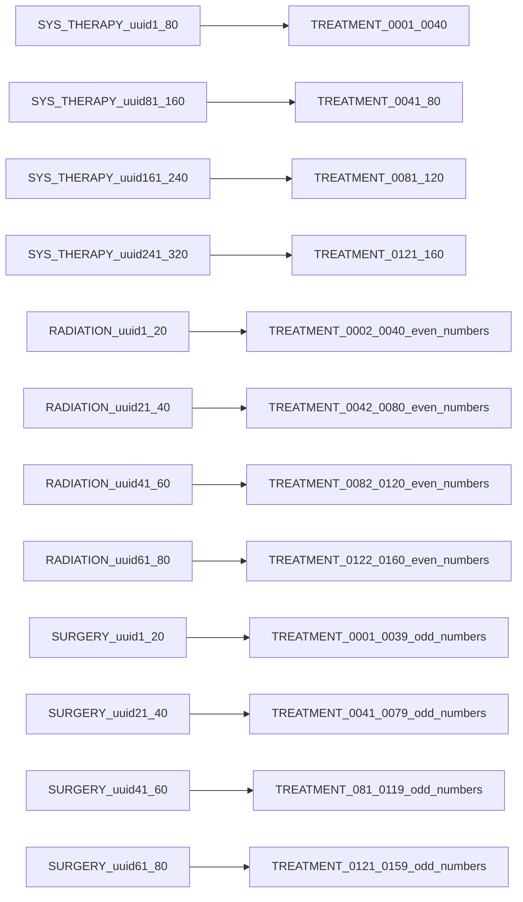
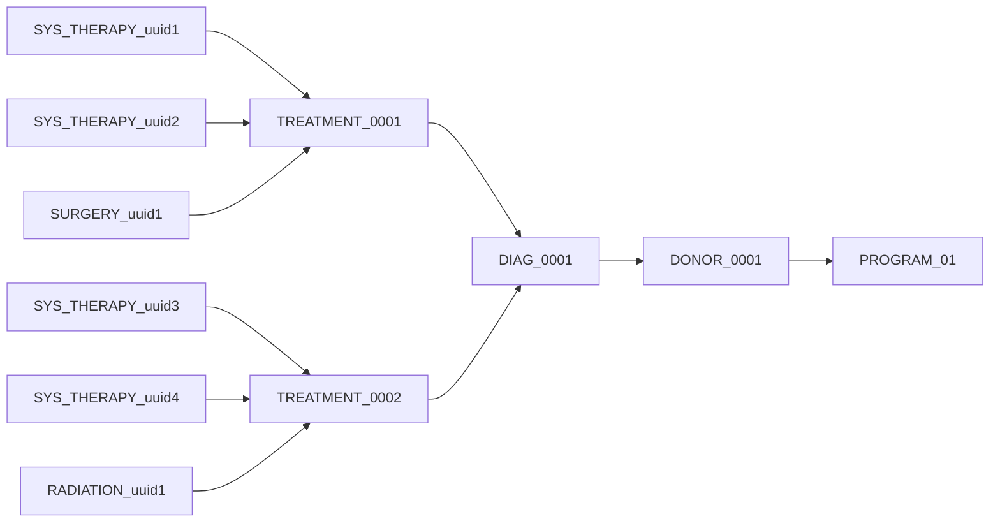
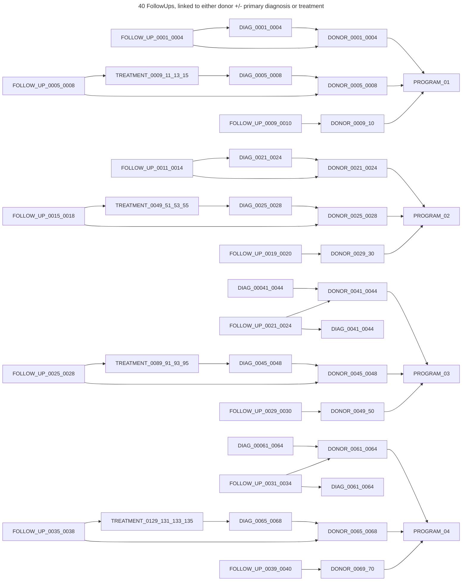
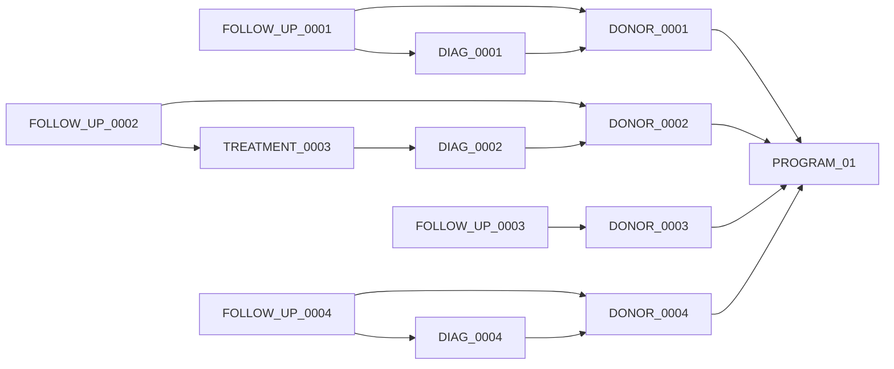
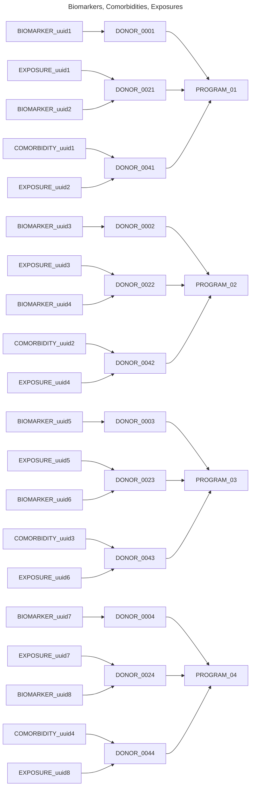

# Small dataset relationships

The small dataset is composed of:
* 4 Programs
* 20 Follow Ups
* 40 Comorbidities, Biomarkers, Exposures
* 80 Donors, Primary Diagnoses, Specimens, Radiations, Surgeries
* 160 Treatments
* 240 Sample registrations
* 320 Systemic Therapies

Identifiers are numbered sequentially per object.

Diagrams below show example linkage relationships for the different objects.

---

## Sample Registrations, Specimens and Primary Diagnoses to Donors

Each donor has one primary diagnosis, each primary diagnosis has one specimen, each specimen has three samples.

Each Specimen has three linked samples, example below with SPECIMEN_0001

---

## Treatments and treatment types

Each diagnosis has two treatments, 

Each Diagnosis has two linked treatments, example below with DIAG_0001

Each treatment has two systemic therapies and either a radiation or surgery.

Radiations are linked to the even numbered treatments while Surgeries are linked to odd numbered treatments. Example with `TREATMENT_0001` below:

---

## Follow ups

Follow ups are linked to the first 10 donors of each program. 

The first four are linked to a primary diagnosis as well as a Donor.

The next four are linked to the first treatment as well as the Donor.

The remaining 2 are linked only to the Donor.

Example Follow up linkages for follow ups `FOLLOW_UP_0001-0004`

---

## Biomarkers, Comorbidities, Exposures to Donors

Biomarkers may be linked to Donor alone or Donor plus treatment, primary diagnosis, specimen or followup. Synthetic data is only linked to Donors for now. Half of donors have a linked biomarker object. Comorbidities are linked directly to Donors, half of the donors in the dataset have a linked comorbidity. Exposures are linked directly to Donors, half of donors have a linked exposure.

---
