*This file is automatically generated, do not edit directly.*

This file was last generated on 2024-03-04 11:08:27. See README for how to regenerate.

You can view the below diagram in a nicer viewer by hitting the 'copy' button and pasting it into the live editor on [mermaid.live](https://mermaid.live)

```mermaid
classDiagram
    class Biomarker {
    ca125 IntegerField
    cea IntegerField
    donor_uuid ForeignKey
    er_percent_positive FloatField
    er_status CharField
    her2_ihc_status CharField
    her2_ish_status CharField
    hpv_ihc_status CharField
    hpv_pcr_status CharField
    hpv_strain ArrayField
    pr_percent_positive FloatField
    pr_status CharField
    program_id ForeignKey
    psa_level IntegerField
    submitter_donor_id CharField
    submitter_follow_up_id CharField
    submitter_primary_diagnosis_id CharField
    submitter_specimen_id CharField
    submitter_treatment_id CharField
    test_date JSONField
    uuid UUIDField
  }
  class Chemotherapy {
    actual_cumulative_drug_dose IntegerField
    chemotherapy_drug_dose_units CharField
    donor_uuid ForeignKey
    drug_name CharField
    drug_reference_database CharField
    drug_reference_identifier CharField
    prescribed_cumulative_drug_dose IntegerField
    program_id ForeignKey
    submitter_donor_id CharField
    submitter_treatment_id CharField
    treatment_uuid ForeignKey
    uuid UUIDField
  }
  class Comorbidity {
    age_at_comorbidity_diagnosis IntegerField
    comorbidity_treatment CharField
    comorbidity_treatment_status CharField
    comorbidity_type_code CharField
    donor_uuid ForeignKey
    laterality_of_prior_malignancy CharField
    prior_malignancy CharField
    program_id ForeignKey
    submitter_donor_id CharField
    uuid UUIDField
  }
  class Donor {
    cause_of_death CharField
    date_alive_after_lost_to_followup JSONField
    date_of_birth JSONField
    date_of_death JSONField
    date_resolution CharField
    gender CharField
    is_deceased BooleanField
    lost_to_followup_after_clinical_event_identifier CharField
    lost_to_followup_reason CharField
    primary_site ArrayField
    program_id ForeignKey
    sex_at_birth CharField
    submitter_donor_id CharField
    uuid UUIDField
  }
  class Exposure {
    donor_uuid ForeignKey
    pack_years_smoked FloatField
    program_id ForeignKey
    submitter_donor_id CharField
    tobacco_smoking_status CharField
    tobacco_type ArrayField
    uuid UUIDField
  }
  class FollowUp {
    anatomic_site_progression_or_recurrence ArrayField
    date_of_followup JSONField
    date_of_relapse JSONField
    disease_status_at_followup CharField
    donor_uuid ForeignKey
    method_of_progression_status ArrayField
    primary_diagnosis_uuid ForeignKey
    program_id ForeignKey
    recurrence_m_category CharField
    recurrence_n_category CharField
    recurrence_stage_group CharField
    recurrence_t_category CharField
    recurrence_tumour_staging_system CharField
    relapse_type CharField
    submitter_donor_id CharField
    submitter_follow_up_id CharField
    submitter_primary_diagnosis_id CharField
    submitter_treatment_id CharField
    treatment_uuid ForeignKey
    uuid UUIDField
  }
  class HormoneTherapy {
    actual_cumulative_drug_dose IntegerField
    donor_uuid ForeignKey
    drug_name CharField
    drug_reference_database CharField
    drug_reference_identifier CharField
    hormone_drug_dose_units CharField
    prescribed_cumulative_drug_dose IntegerField
    program_id ForeignKey
    submitter_donor_id CharField
    submitter_treatment_id CharField
    treatment_uuid ForeignKey
    uuid UUIDField
  }
  class Immunotherapy {
    actual_cumulative_drug_dose IntegerField
    donor_uuid ForeignKey
    drug_name CharField
    drug_reference_database CharField
    drug_reference_identifier CharField
    immunotherapy_drug_dose_units CharField
    immunotherapy_type CharField
    prescribed_cumulative_drug_dose IntegerField
    program_id ForeignKey
    submitter_donor_id CharField
    submitter_treatment_id CharField
    treatment_uuid ForeignKey
    uuid UUIDField
  }
  class PrimaryDiagnosis {
    basis_of_diagnosis CharField
    cancer_type_code CharField
    clinical_m_category CharField
    clinical_n_category CharField
    clinical_stage_group CharField
    clinical_t_category CharField
    clinical_tumour_staging_system CharField
    date_of_diagnosis JSONField
    donor_uuid ForeignKey
    laterality CharField
    lymph_nodes_examined_method CharField
    lymph_nodes_examined_status CharField
    number_lymph_nodes_positive IntegerField
    program_id ForeignKey
    submitter_donor_id CharField
    submitter_primary_diagnosis_id CharField
    uuid UUIDField
  }
  class Program {
    created DateTimeField
    metadata JSONField
    program_id CharField
    updated AutoDateTimeField
  }
  class Radiation {
    anatomical_site_irradiated CharField
    donor_uuid ForeignKey
    program_id ForeignKey
    radiation_boost BooleanField
    radiation_therapy_dosage IntegerField
    radiation_therapy_fractions IntegerField
    radiation_therapy_modality CharField
    radiation_therapy_type CharField
    reference_radiation_treatment_id CharField
    submitter_donor_id CharField
    submitter_treatment_id CharField
    treatment_uuid ForeignKey
    uuid UUIDField
  }
  class SampleRegistration {
    donor_uuid ForeignKey
    program_id ForeignKey
    sample_type CharField
    specimen_tissue_source CharField
    specimen_type CharField
    specimen_uuid ForeignKey
    submitter_donor_id CharField
    submitter_sample_id CharField
    submitter_specimen_id CharField
    tumour_normal_designation CharField
    uuid UUIDField
  }
  class Specimen {
    donor_uuid ForeignKey
    pathological_m_category CharField
    pathological_n_category CharField
    pathological_stage_group CharField
    pathological_t_category CharField
    pathological_tumour_staging_system CharField
    percent_tumour_cells_measurement_method CharField
    percent_tumour_cells_range CharField
    primary_diagnosis_uuid ForeignKey
    program_id ForeignKey
    reference_pathology_confirmed_diagnosis CharField
    reference_pathology_confirmed_tumour_presence CharField
    specimen_anatomic_location CharField
    specimen_collection_date JSONField
    specimen_laterality CharField
    specimen_processing CharField
    specimen_storage CharField
    submitter_donor_id CharField
    submitter_primary_diagnosis_id CharField
    submitter_specimen_id CharField
    tumour_grade CharField
    tumour_grading_system CharField
    tumour_histological_type CharField
    uuid UUIDField
  }
  class Surgery {
    donor_uuid ForeignKey
    greatest_dimension_tumour IntegerField
    lymphovascular_invasion CharField
    margin_types_involved ArrayField
    margin_types_not_assessed ArrayField
    margin_types_not_involved ArrayField
    perineural_invasion CharField
    program_id ForeignKey
    residual_tumour_classification CharField
    submitter_donor_id CharField
    submitter_specimen_id CharField
    submitter_treatment_id CharField
    surgery_location CharField
    surgery_site CharField
    surgery_type CharField
    treatment_uuid ForeignKey
    tumour_focality CharField
    tumour_length IntegerField
    tumour_width IntegerField
    uuid UUIDField
  }
  class Treatment {
    days_per_cycle IntegerField
    donor_uuid ForeignKey
    is_primary_treatment CharField
    line_of_treatment IntegerField
    number_of_cycles IntegerField
    primary_diagnosis_uuid ForeignKey
    program_id ForeignKey
    response_to_treatment CharField
    response_to_treatment_criteria_method CharField
    status_of_treatment CharField
    submitter_donor_id CharField
    submitter_primary_diagnosis_id CharField
    submitter_treatment_id CharField
    treatment_end_date JSONField
    treatment_intent CharField
    treatment_setting CharField
    treatment_start_date JSONField
    treatment_type ArrayField
    uuid UUIDField
  }
  
Program -- Donor : ""
Program -- PrimaryDiagnosis : ""
Program -- Comorbidity : ""
Program -- Biomarker : ""
Program -- Exposure : ""
Program -- FollowUp : ""
Program -- Specimen : ""
Program -- Treatment : ""
Program -- SampleRegistration : ""
Program -- Chemotherapy : ""
Program -- HormoneTherapy : ""
Program -- Immunotherapy : ""
Program -- Radiation : ""
Program -- Surgery : ""
Donor -- PrimaryDiagnosis : ""
Donor -- Comorbidity : ""
Donor -- Biomarker
Donor -- Exposure
Donor -- FollowUp
Donor -- Specimen
Donor -- Treatment
Donor -- SampleRegistration
Donor -- Chemotherapy
Donor -- HormoneTherapy
Donor -- Immunotherapy
Donor -- Radiation
Donor -- Surgery
PrimaryDiagnosis -- Specimen
PrimaryDiagnosis -- Treatment
PrimaryDiagnosis -- FollowUp
Specimen -- SampleRegistration
Treatment -- Chemotherapy
Treatment -- HormoneTherapy
Treatment -- Immunotherapy
Treatment -- Radiation
Treatment -- Surgery
Treatment -- FollowUp

```

