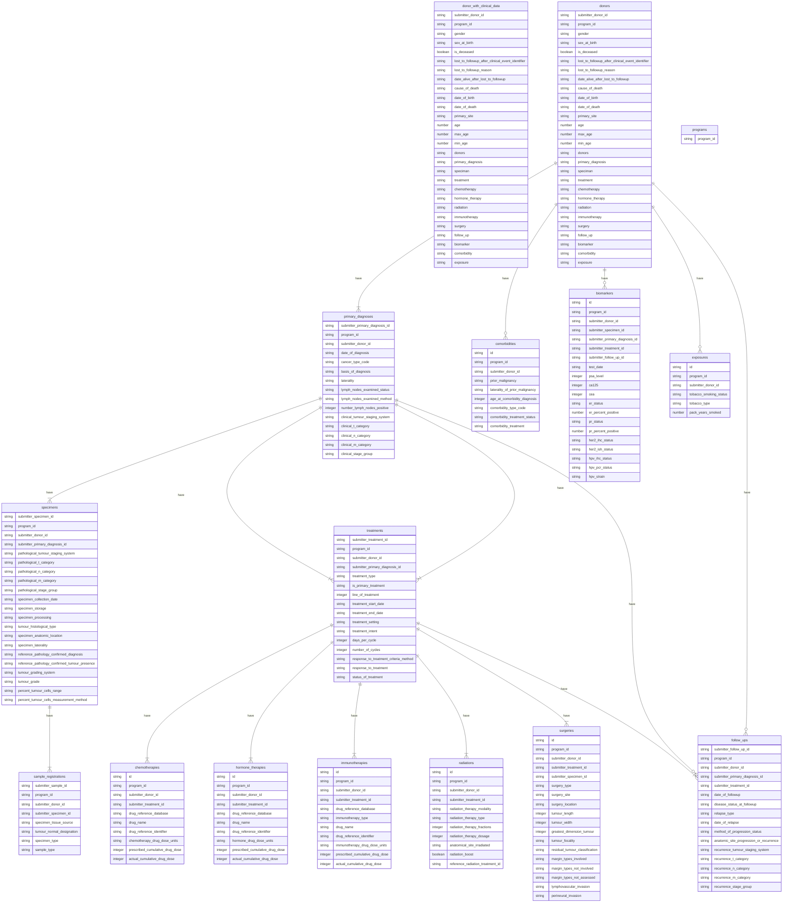

```mermaid
erDiagram
	biomarkers {
		string id
		string program_id
		string submitter_donor_id
		string submitter_specimen_id
		string submitter_primary_diagnosis_id
		string submitter_treatment_id
		string submitter_follow_up_id
		string test_date
		integer psa_level
		integer ca125
		integer cea
		string er_status
		number er_percent_positive
		string pr_status
		number pr_percent_positive
		string her2_ihc_status
		string her2_ish_status
		string hpv_ihc_status
		string hpv_pcr_status
		string hpv_strain
}

	chemotherapies {
		string id
		string program_id
		string submitter_donor_id
		string submitter_treatment_id
		string drug_reference_database
		string drug_name
		string drug_reference_identifier
		string chemotherapy_drug_dose_units
		integer prescribed_cumulative_drug_dose
		integer actual_cumulative_drug_dose
}

	comorbidities {
		string id
		string program_id
		string submitter_donor_id
		string prior_malignancy
		string laterality_of_prior_malignancy
		integer age_at_comorbidity_diagnosis
		string comorbidity_type_code
		string comorbidity_treatment_status
		string comorbidity_treatment
}

	donor_with_clinical_data {
		string submitter_donor_id
		string program_id
		string gender
		string sex_at_birth
		boolean is_deceased
		string lost_to_followup_after_clinical_event_identifier
		string lost_to_followup_reason
		string date_alive_after_lost_to_followup
		string cause_of_death
		string date_of_birth
		string date_of_death
		string primary_site
		number age
		number max_age
		number min_age
		string donors
		string primary_diagnosis
		string speciman
		string treatment
		string chemotherapy
		string hormone_therapy
		string radiation
		string immunotherapy
		string surgery
		string follow_up
		string biomarker
		string comorbidity
		string exposure
}

	donors {
		string submitter_donor_id
		string program_id
		string gender
		string sex_at_birth
		boolean is_deceased
		string lost_to_followup_after_clinical_event_identifier
		string lost_to_followup_reason
		string date_alive_after_lost_to_followup
		string cause_of_death
		string date_of_birth
		string date_of_death
		string primary_site
		number age
		number max_age
		number min_age
		string donors
		string primary_diagnosis
		string speciman
		string treatment
		string chemotherapy
		string hormone_therapy
		string radiation
		string immunotherapy
		string surgery
		string follow_up
		string biomarker
		string comorbidity
		string exposure
}

	exposures {
		string id
		string program_id
		string submitter_donor_id
		string tobacco_smoking_status
		string tobacco_type
		number pack_years_smoked
}

	follow_ups {
		string submitter_follow_up_id
		string program_id
		string submitter_donor_id
		string submitter_primary_diagnosis_id
		string submitter_treatment_id
		string date_of_followup
		string disease_status_at_followup
		string relapse_type
		string date_of_relapse
		string method_of_progression_status
		string anatomic_site_progression_or_recurrence
		string recurrence_tumour_staging_system
		string recurrence_t_category
		string recurrence_n_category
		string recurrence_m_category
		string recurrence_stage_group
}

	hormone_therapies {
		string id
		string program_id
		string submitter_donor_id
		string submitter_treatment_id
		string drug_reference_database
		string drug_name
		string drug_reference_identifier
		string hormone_drug_dose_units
		integer prescribed_cumulative_drug_dose
		integer actual_cumulative_drug_dose
}

	immunotherapies {
		string id
		string program_id
		string submitter_donor_id
		string submitter_treatment_id
		string drug_reference_database
		string immunotherapy_type
		string drug_name
		string drug_reference_identifier
		string immunotherapy_drug_dose_units
		integer prescribed_cumulative_drug_dose
		integer actual_cumulative_drug_dose
}

	primary_diagnoses {
		string submitter_primary_diagnosis_id
		string program_id
		string submitter_donor_id
		string date_of_diagnosis
		string cancer_type_code
		string basis_of_diagnosis
		string laterality
		string lymph_nodes_examined_status
		string lymph_nodes_examined_method
		integer number_lymph_nodes_positive
		string clinical_tumour_staging_system
		string clinical_t_category
		string clinical_n_category
		string clinical_m_category
		string clinical_stage_group
}

	programs {
		string program_id
}

	radiations {
		string id
		string program_id
		string submitter_donor_id
		string submitter_treatment_id
		string radiation_therapy_modality
		string radiation_therapy_type
		integer radiation_therapy_fractions
		integer radiation_therapy_dosage
		string anatomical_site_irradiated
		boolean radiation_boost
		string reference_radiation_treatment_id
}

	sample_registrations {
		string submitter_sample_id
		string program_id
		string submitter_donor_id
		string submitter_specimen_id
		string specimen_tissue_source
		string tumour_normal_designation
		string specimen_type
		string sample_type
}

	specimens {
		string submitter_specimen_id
		string program_id
		string submitter_donor_id
		string submitter_primary_diagnosis_id
		string pathological_tumour_staging_system
		string pathological_t_category
		string pathological_n_category
		string pathological_m_category
		string pathological_stage_group
		string specimen_collection_date
		string specimen_storage
		string specimen_processing
		string tumour_histological_type
		string specimen_anatomic_location
		string specimen_laterality
		string reference_pathology_confirmed_diagnosis
		string reference_pathology_confirmed_tumour_presence
		string tumour_grading_system
		string tumour_grade
		string percent_tumour_cells_range
		string percent_tumour_cells_measurement_method
}

	surgeries {
		string id
		string program_id
		string submitter_donor_id
		string submitter_treatment_id
		string submitter_specimen_id
		string surgery_type
		string surgery_site
		string surgery_location
		integer tumour_length
		integer tumour_width
		integer greatest_dimension_tumour
		string tumour_focality
		string residual_tumour_classification
		string margin_types_involved
		string margin_types_not_involved
		string margin_types_not_assessed
		string lymphovascular_invasion
		string perineural_invasion
}

	treatments {
		string submitter_treatment_id
		string program_id
		string submitter_donor_id
		string submitter_primary_diagnosis_id
		string treatment_type
		string is_primary_treatment
		integer line_of_treatment
		string treatment_start_date
		string treatment_end_date
		string treatment_setting
		string treatment_intent
		integer days_per_cycle
		integer number_of_cycles
		string response_to_treatment_criteria_method
		string response_to_treatment
		string status_of_treatment
}

donors ||--|{ primary_diagnoses : "have"
donors ||--o{ comorbidities : "have"
donors ||--o{ biomarkers : "have"
donors ||--o{ exposures : "have"
donors ||--o{ follow_ups : "have"
primary_diagnoses ||--|{ specimens : "have"
primary_diagnoses ||--|{ treatments : "have"
primary_diagnoses ||--|{ treatments : "have"
primary_diagnoses ||--o{ follow_ups : "have"
specimens ||--|{ sample_registrations : "have"
treatments ||--|{ chemotherapies : "have"
treatments ||--|{ hormone_therapies : "have"
treatments ||--|{ immunotherapies : "have"
treatments ||--|{ radiations : "have"
treatments ||--|{ surgeries : "have"
treatments ||--|{ follow_ups : "have"

```
